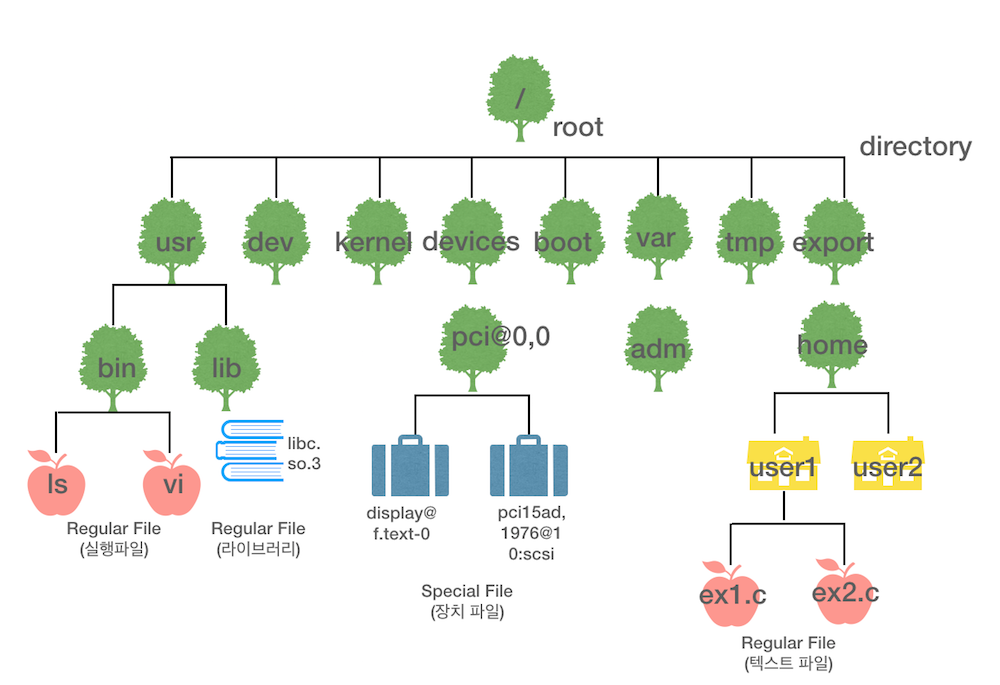
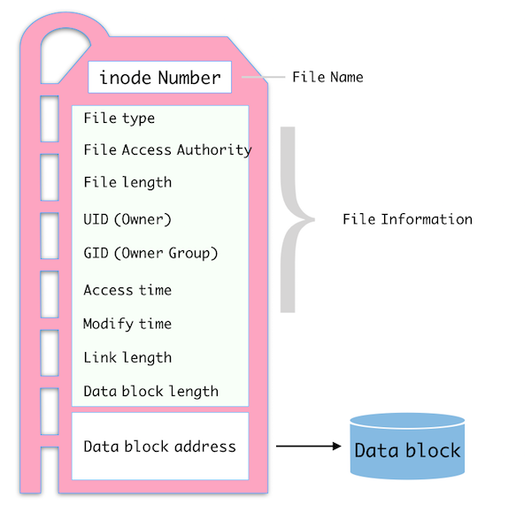
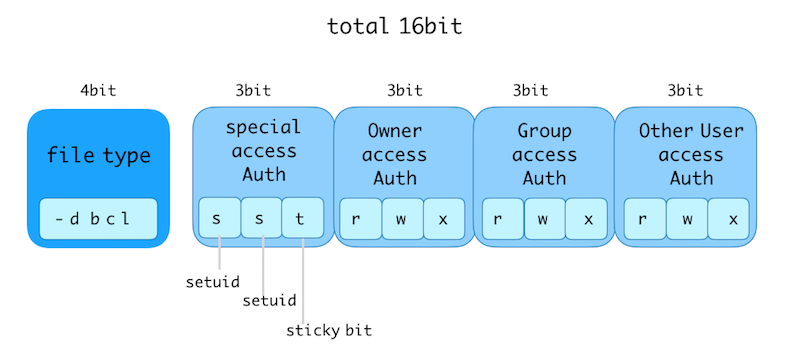

#3. 파일과 디렉토리
 ##3-1. 개요

- - -

 * 유닉스에서 파일은 regular file과 special file , directory로 구분할 수 있다. 

 일반파일은 텍스트파일 실행파일등 테스트나 바이너리 형태의 데이터를 저장하고 있는 파일이다. 
 유닉스에서 파일은 데이터를 저장하거나 장치를 구동하는데도 사용한다. 
 여기서 장치 관련 특수 파일은 device file이라고도 한다. 
 디렉토리는 해당 디렉토리에 속한 파일을 관리하는 특별한 파일이다. 
 유닉스에서는 디렉토리도 파일로 취급한다. 
 유닉스에서 파일은 파일명,  inode, data block으로 구성된다. 
 파일명은 사용자가 파일에 접근할 때 사용한다. 
 inode는 외부적으로는 번호로 표시되고, 파일의 소유자/크기 등의 정보와 데이터 블록의 위치를 나타내는 주소들이 저장되어있다.
 데이터블록은 실제로 데이터가 저장되는 하드디스크의 공간이다. 

 유닉스에서는 파일의 정보를 inode에서 읽어온다. inode에서 검색할 수 있는 정보는 파일이 종류, 접근권한, 하드링크개수, 소유자의 UID/GID, 파일의 크기, 파일 접근 시각, 수정시각, 파일의 inode변경시각 등이다. 

 이 정보는 sys/stat.h 에 정의된 stat구조체에 저장된다. 


 * link는 기존 파일이나 디렉토리에 접근할 수 있는 새로운 이름을 뜻한다. 

 링크를 사용하면 복잡한 파일명을 간단한 다른 파일명으로 접근하게 하거나 플렛폼에 따라 달라지는 특수 파일에 같은 링크 파일명을 제공해 동일한 방식으로 접근할 수 있다는 장점이 잇다. 

 이렇게 링크를 만들 수 있는 기능으로 **hard link, symbolic link**가 있다. 
 하드링크는 기존 파일과 동일한 inode를 사용한다. 
 심볼릭 링크는 기존 파일에 접근할 수 있는 다른 파일을 만드는데, 기존 파일과 다른 inode를 사용해서 기존 파일의 경로를 저장한다. 

 * 파일을 생성하는 것처럼 디렉토리도 함수를 사용해서 생성하고 삭제할 수 있고, 이동하거나 내용을 읽을 수도 있다. 


 ##3-2. 유닉스 파일의 특징

***

 유닉스에서 파일은 데이터 저장, 장치 구동, 프로세스간 통신(interprocess communication) 등에 사용한다.

  ###3-2-1. 파일의 종류

 파일은 크게 일반파일, 특수 파일, 그리고 디렉토리로 구분된다. 



 * 일반 파일
 
 텍스트 파일, 실행 파일, 라이브러리, 이미지 등 유닉스에서 사용하는 대부분의 파일이 일반 파일에 해당한다. 
 일반 파일은 데이터 블록에 텍스트나 바이너리 형태의 데이터를 저장하고 있다. 
 vi 같은 편집기를 이용해 만들기도 하고, 컴파일러나 다른 응용 프로그램에서 사용할 수 있다. 

`#ls -l /usr/bin`

 * 특수 파일

 유닉스에서 장치를 사용하려면 해당 장치와 연관된 특수파일을 이용해야한다. 
 장치관련 특수 파일은 장치 파일이라고도 한다. 
 장치파일은 데이터 블록을 사용하지 않는다. 대신 장치의 종류를 나타내는 장치 번호를 inode에 저장한다.

`#ls -l /devices/pci@0,0`

 장치 파일은 block device파일과 character device파일로 구분된다. 블록 장치 파일은 블록 단위로 데이터를 읽고 쓴다. 솔라리스에서 기본 block size는 8KB이다. 

 문자 장치 파일은 하드디스크인 경우 sector단위로 읽고 쓰는데 솔라리스에서 기본크기는 512byte이다. 
 문자 장치 파일을 raw device라고 한다. 

 장치파일은 ls -l명령의 결과에서 파일의 크기를 나타내는 부분이 169, 0과 같은 형태로 출력된다. 
 이는 장치 파일의 크기가 아닌 장치 번호를 나타낸다. 장치의 종류와 장치의 개체수를 의미한다. 

 장치의 종류를 나타내는 번호를 major device number, 장치 개체수를 의미하는 번호를 minor device number라고 한다. 
 기본적인 장치 파일은 유닉스를 처음 설치할 때 생성되며, 추가로 장착하는 장치의 장치파일은 추가 절차에 따라 생성된다. 


 * 디렉터리

 유닉스에서는 디렉토리도 파일로 취급한다. 디렉토리와 연관된 데이터 블록은 해당 디렉토리에 속한 파일의 목록과 inode를 저장한다.

  * 디렉토리 생성함수 : mkdir
  * 디렉토리 삭제함수 : rmdir
  * 복사 : cp -r


 * 파일의 종류 구분

 ls -l 명령을 사용하면 파일의 종류를 알 수 있다. ls -l 명령의 결과에서 첫글자로 장치의 종류를 구분한다. 

```
 	#ls -l /usr/bin/vi
	lrwxr-xr-x  1 root  wheel  3 11 27 23:16 /usr/bin/vi -> vim

```


<파일의 종류 식별 문자>

|문자|파일의 종류|
|--|--|
|-| 일반파일|
|d|디렉토리|
|b|블록 장치 특수 파일|
|c|문자 장치 특수 파일|
|l|심볼릭 링크|

 
  ###3-2-2. 파일의 구성요소

 유닉스에서 파일은 파일명, inode, 데이터 블록으로 구성된다. 

 * 파일명

 파일명은 사용자가 파일에 접근할 때 사용하며, 파일명과 관련된 inode가 반드시 있어야한다. 

 예전에는 유닉스의 파일명으로 최대 14자까지 사용할 수 있었지만, 현재는 255자까지 만들 수 있다. 파일명은 / 등 일부 특수 문자를 파일명에 사용할 수 없다. 

 파일명을 만들때 다음 사항에 유의해야한다.

   1. 파일과 디렉토리 이름에는 알파벳, 숫자, 하이픈(-), 밑줄(_), 점(.)만을 사용한다. 

   2. 파일과 디렉토리 이름에 공백, *ㅓ, &, |, ", ', 가운데 점, ~, #, $, (, ), \, ;, <, >는 쓰지 않는다. 

   3. 파일과 디렉토리 이름에 사용하는 알파벳은 대소문자를 구분한다.

   4. 파일과 디렉토리 이름이 (.)점으로 시작하면 숨김파일(hidden file)이다. 

 * inode
 
 inode는 외부적으로는 번호로 표현하며 내부적으로는 두 부분으로 나누어 정보를 저장한다. 




inode의 첫번째 부분은 파일에 관한 정보를 저장하는 부분으로, 파일의 종류와 접근권한, 하드링크수, 소유자, 그룹, 파일크기, 파일변경시각, 파일명등을 저장한다. 

ls -l 명령은 inode의 명령을 읽어서 출력한다. 

두번째 부분은 파일의 실제 데이터를 저장하고 있는 데이터 블록의 위치를 나타내는 주소들을 저장한다. 파일의 inode 번호는 ls -l로 알수 있다. 


 * 데이터 블록

데이터 블록(data block)은 실제로 데이터가 저장되는 하드 디스크의 공간이다. 일반 파일이나 디렉토리, 심볼릭 링크는 데이터 블록에 관련 내용을 직접 저장하지만, 장치 파일은 데이터 블록을 사용하지 않고 장치에 대한 정보를 inode에 저장한다. 
 

 ##3-3. 파일 정보 검색

***

유닉스에서 파일의 정보를 검색하려면 ls 명령을 사용한다. 파일에 관한 제사한 정보는 inode에 저장되어 있다. inode의 정보를 검색하려면 stat, lstat, fstat 함수를 사용한다. 이중 lstat은 심볼릭 링크 파일의 inode를 검색하는 함수로 다음절에서 배운다. 

 * 파일명으로 파일 정보 검색 : stat(2)


```c

include <fcntl.h>
include <sys/types.h>
include <sys/stat.h>

int stat(const char *restrict path, struct stat *buf);

* path : 정보를 알고자 하는 파일명
* buf : 검색한 파일 정보를 저장할 구조체 주소

```

파일 정보를 검색하는데 가장 많이 사용하는 함수는 stat이다. 이 함수는 path에 저장된 파일의 정보를 검색해 buf로 지정한 구조체에 저장한다.

 이 파일에 대한 모든 권한이 있어야하는건 아니지만, 해당 파일이 위치한 경로의 각 디렉토리에 대한 읽기 권한이 필요하다. 

   * stat 구조체
   stat 함수로 검색한 inode 정보는 stat 구조체에 저장된다. stat 구조체 (struct stat)는 <sys/stat.h>파일에 정의되어 있으며, 구조는 다음과 같다. 


```c

 struct stat{
	
    dev_t st_dev; //inode가 저장된 장치의 장치번호 저장.
    ino_t st_ino; //inode 번호
    mode_t st_mode; //파일의 형식과 접근 권한을 저장.
    nlink_t st_nlink; //하드링크의 개수
    uid_t st_uid; //파일소유자의 UID
    gid_t st_gid;
    dev_t st_rdev;  //장치 파일인 경우 주 장치번호와 부 장치 번호를 저장.
    off_t st_size; 
    time_t st_atime; //마지막으로 파일을 읽거나, 실행한 시각. 이때 시각은 1970년 1월 1일 이후의 시간을 초단위로 저장함.
    time_t st_mtime; //마지막으로 파일의 내용을 변경(쓰기)한 시각 
    time_t st_ctime; //마지막으로 inode의 내용을 변경한 시각. inode의 내용은 소유자/그룹 변경, 파일 크기 변경, 링크 개수 변경 등을 수행할 때 변경된다. 
    blksize_t st_blksize; //파일의 내용을 입출력할 때 사용하는 버퍼의 크기
    blkcnt_t st_blocks; //파일을 512바이트씩 블록으로 나눈 개수를 저장.
    char st_fstype[_SF_FSTYPSZ]; //파일시스템 종류.

```


 * 파일기술자로 보는 파일 검색 : fstat(2)

```c

#include <sys/types.h>
#include <sys/stat.h>

int fstat(int fd, struct stat *buf);

* fd : 열려 있는 파일의 파일 기술자
* buf : 검색한 파일 정보를 저장할 구조체 주소

```

fstat 함수는 파일 경로 대신 현재 열려 있는 파일의 파일 기술자를 인자로 받아 파일 정보를 검색한 후 buf로 지정한 구조체에 저장한다. 


 ##3-4. 파일 접근 권한 제어
 
***

stat 구조체의 st_mode 항목에는 파일의 종류와 접근 권한 정보가 저장된다. 
st_mode의 값은 100644와 같이 숫자로 출력된다. st_mode항목의 값을 해석하려면
<sys/stat.h>에 정의된 상수와 매크로를 이용해야한다.

  ###3-4-1. st_mode 값의 구조
 
  st_mode 항목에 저장되는 값의 구조를 알아야 상수와 매크로의 역할을 이해할 수 있다. 
  st_mode 항목의 데이터형인 mode_t는 unsigned int로 정의되어있다. 
  실제로는 이중 16비트를 사용한다. 



  <sys/stat.h>파일에 정의된 상수와 매크로는 위 그림과 같은 구조로 저장된 값과 상수를 AND 연산해서 값을 추출하는 것이다. 

  ###3-4-2. 파일의 종류 검색

  파일의 종류를 검색하는데 상수와 매크로를 사용할 수 있다. 

* 상수를 이용한 파일 종류 검색

 <sys/stat.h>에 파일의 종류 검색과 관련해 정의되어있는 상수는 다음과 같다. 

|상수명|상수값(16진수)|기능|
|--|--|--|
|S_IFMT|0xF000|st_mode에서 파일의 종류를 정의한 부분을 가져옴|
|S_IFIFO|0x1000|FIFO파일|
|S_IFCHR|0x2000|문자 장치 특수 파일|
|S_IFDIR|0x4000|디렉토리|
|S_IFBLK|0x6000|블록 장치 특수 파일|
|S_IFREG|0x8000|일반 파일|
|S_IFLNK|0xA000|심볼릭 링크 파일|
|S_IFSOCK|0xC000|소켓 파일|

S_IFMT 상수 값이 0xF000 이므로 st_mode의값과 AND 연산하면 파일 종류 부분만 남게 된다.
이 값을 다른 상수값과 비교하면 해당 파일의 종류를 알 수 있다. 

 
* 매크로를 이용한 파일 종류 검색

 <sys/stat.h>파일에는 상수 외에 매크로도 정의되어 있다. 파일의 종류 검색과 관련해 정의되어 있는 매크로는 다음과 같다. 이 매크로들은 POSIX 표준이다. 

|매크로명|매크로 정의|기능|
|--|--|--|
|S_ISFIFO(mode)|(((mode&0xF000)==0x1000)|참이면 FIFO 파일|
|S_IFCHR(mode)|(((mode)&0xF000)==0x2000)|참이면 문자 장치 특수 파일|
|S_IFDIR(mode)|(((mode)&0xF000)==0x4000)|참이면 디렉토리|
|S_IFBLK(mode)|(((mode)&0xF000)==0x6000)|블록 장치 특수 파일|
|S_IFREG(mode)|(((mode)&0xF000)==0x8000)|일반 파일|
|S_IFLNK(mode)|(((mode)&0xF000)==0xA000)|심볼릭 링크 파일|
|S_IFSOCK(mode)|(((mode)&0xF000)==0xC000)|소켓 파일|

각 매크로는 인자로 받은 mode값을 0xFOOO과 AND 연산한다. AND연산의 결과를 파일의 종류별로 정해진 값과 비교해 참인지 여부로 파일의 종류를 판단한다. 


  ###3-4-3. 파일 접근 권한 검색

파일의 접근 권한도 st_mode의 값으로 알 수 있다. 이외에도 사용자가 파일에 대한 접근 권한이 있는지 확인할 수 있는 ` access `와 같은 함수가 제공된다. 

* 상수를 이용한 파일 접근 권한 검색
 
st_mode값에서 파일의 접근권한을 검색할 때도 <sys/stat.h>에 정의된 상수를 이용한다. 

|상수명|상수값|기능|
|--|--|--|
|S_ISUID|0x800|st_mode값과 AND 연산이 0이 아니면 setuid가 설정됨|
|S_ISGID|0x400|st_mode값과 AND 연산이 0이 아니면 setgid가 설정됨|
|S_ISVTX|0x200|... sticky bit가 설정됨.|
|S_IREAD|00400|소유자의 읽기 권한 확인|
|S_IWRITE|00200|소유자의 쓰기 권한 확인|
|S_IEXEC|00100|소유자의 실행 권한 확인|

위의 표에서 읽기/쓰기/실행 권한을 추출하는 상수값이 8진수라는 점을 주의한다. 
표를 보면 소유자의 접근권한은 추출할 수 있지만, 그룹이나 기타 사용자의 접근권한에 해당하는 상수는 별도로 정의 되어 있지 않음을 알 수 있다. 

st_mode 값을 왼쪽으로 3비트 이동시키거나 상수값을 오른쪽으로 3비트 이동시킨 후 
AND연산을 수행하면 그룹의 접근권한을 알 수 있다.

`st_mode & (S_IREAD >> 3) `

기타 사용자의 경우 st_mode의 값을 왼쪽으로 6비트 이동시키거나 상수값을 오른쪽으로 6비트 이동시킨 후 AND 연산을 수행하면 된다. 

POSIX에서는 이와 같이 번거롭게 shift연산을 하는 대신 직접 AND연산이 가능한다른 상수를 정의했다. 

|상수명|상수값|기능|
|--|--|--|
|S_IRSXU|00700|소유자 읽기/쓰기/실행 권한|
|S_IRUSR|00400|소유자 읽기 권한|
|S_IWUSR|00200|소유자 쓰기 권한|
|S_IXUSR|00100|소유자 실행 권한|
|S_IRWXG|00070|그룹 읽기/쓰기/실행 권한|
|S_IRGRP|00040|그룹 읽기 권한|
|S_IWGRP|00020|그룹 쓰기 권한|
|S_IXGRP|00010|그룹 실행 권한|
|S_IRWXO|00007|기타 사용자 읽기/쓰기/실행 권한|
|S_IROTH|00004|기타 사용자 읽기 권한|
|S_IWOTH|00002|기타 사용자 쓰기 권한|
|S_IXOTH|00001|기타 사용자 실행 권한|

* 함수를 사용한 접근 권한 검색 : access(2)

```c

#include <unistd.h>
int access(const char *path, int amode);

* path: 접근권한을 알고자 하는 파일의 경로
* amode :  접근 권한(R_OK:읽기권한 / W_OK:쓰기권한 /X_OK / F_OK: 파일 존재확인)
  이 상수 파라미터는 <unistd.h>에 정의되어 있으며 OR로 연결해서 복수로 사용할 수 있다. 

* return value 
  접근권한 있음:  0
  오류:-1 
  파일이 존재하지 않음 : ENOEN  
  해당 경로에 접근 권한이 없음 : EACCES 

```

 파일의 접근 권한을 검색할 수 있는 시스템 호출로 access함수가 있다. 
이 함수는 유효사용자ID(effective user id)가 아닌 실제 사용자(real user id)에 대한 접근 권한만 확인해준다. 


  ###3-4-4. 파일 접근 권한 변경

* 파일명으로 접근권한 변경 : chmod(2)

```c
 
<함수원형>
#include <sys/types.h>
#include <sys/stat.h>

int chmod(const char *path, mode_t mode);

*path : 접근권한을 변경하려는 파일의경로
*mode : 접근 권한

*사용예
 
 chmod(path, S_IRWXU);
 chmod(path, S_IRWXU|S_IRGP|S_IXGRP|S_IROTH);
 
```

 기존 접근권한을 변경해 권한을 조정할 수 있다. 이때 stat함수로 기존 접근권한을 읽고, 여기에 더하거나 뺄 수 있다. 더할 때는 OR 연산자를 사용한다. 

예를 들어 그룹의 쓰기 권한을 추가하려면 다음과 같다. 

` mode |= S_IWGRP; `

접근 권한을 제거하려면, 제거하려는 권한의 상수값을 NOT연산한후 AND연산을 수행하면 된다. 

예를 들어, 기타 사용자의 읽기 권한을 제거하려면 다음과같다.

` mode &= ~(S_IROTH); `

mode값을 변경하고 chmod함수를 호출해야 접근 권한이 변경된다. 

* 파일 기술자로 접근 권한 변경: fchmode(2)

```c
 
<함수원형>

#include <sys/types.h>
#include <sys/stat.h>

int fchmod(int fd, mode_t mode);

*fd : 열려있는 파일의 파일 기술자
*mode : 접근 권한. 

```

fcmod 함수는 접근권한을 변경할 파일의 파일 기술자를 받아서 mode에 미리 정의된 상수값으로 변경할 권한을 지정한다. 

 ##3-5. 링크 파일 생성

***

link는 이미 있는 파일이나 디렉토리에 접근할 수 있는 새로운 이름을 의미한다. 
같은 파일이나 디렉토리지만 여러 이름으로 접근할 수 있게 해주는 것이다. 

솔라리스에서 하드디스크를 나타내는 장치파일은 

` /device/pci@0,0/pci-ide@7,1/ide@0/cmdk@0,0:q `

와 같이 복잡한 이름을 사용한다. 

사용자가 디스크에 접근할 때 이렇게 복잡한 파일명을 사용하는 대신에 쉬운 파일명을 사용할 수 있도록 만들어주는 것이 링크이며 디스크에 대한 링크로 

` /dev/dsk/c0t0d0s0 `

을 제공한다.

링크명의 사용은 플랫폼에 따라 실제 장치 파일명이 다르더라도 같은 링크명을 제공하면 동일한 방식으로 접근할 수 있다. 

링크 생성 기능으로 하드 링크, 심볼릭 링크가 있다. 링크는 ln 명령으로 생성하며 프로그램에서도 함수를 사용해서 하드링크와 심볼릭 링크를 사용할 수 있다. 


  ###3-5-1. 하드 링크(Hard link)

파일에 접근할 수 있는 파일명을 새로 생성한다. 
하드링크는 기존 파일과 동일한 inode를 사용한다. 

하드링크를 생성하면 inode에 저장한 링크 개수가 증가한다. 

* 하드 링크 생성 : link(2)

```c

#include <unistd.h>

int link(const char *existring, const char *new);

* existing : 기존 파일의 경로
* new : 새로 생성할 링크의 경로

*return : 성공 0, 실패 -1

```
  
  ###3-5-2. 심볼릭 링크 (symbolic link)

기존 파일에 접근할 수 있는 다른 파일을 만드는 개념이다. 
기존 파일과 다른 inode를 사용하고, 기존 파일의 경로를 저장한다. 

* 심볼릭 링크 생성 : symlink(2)

```c

#include <unistd.h>

int symlink(const char *name1, const char *name2);

*name1: 기존 파일 경로
*name2: 새로 생성할 링크 경로

*return : 성공 0, 실패 -1

```

심볼릭 링크는 기존 파일과 다른 파일 시스템에도 생성할 수 있다. 


* 심볼릭 링크의 정보 검색 : lstat(2)

```c

#include <sys/type.h>
#include <sys/stat.h>

int lstat(const char *path, struct stat *buf);

*path : 심볼릭 링크의 경로
*buf : 검색한 파일 정보를 저장할 구조체 주소

```

이 함수는 심볼릭 링크 자체의 파일 정보를 검색한다. 심볼릭 링크를 stat함수로 검색하면 원파일의 정보가 검색된다. 


* 심볼릭 링크의 내용 읽기 : readlink(2)

```c

#include <unistd.h>

ssize_t readlink(const char *restrict path, char *restrict buf, size_t bufsiz);

* path : 심볼릭 링크의 경로
* buf : 읽어온 내용을 저장할 버퍼
* bufsiz : 버퍼의 크기

* return : 성공시 읽어온 데이터의 크기byte, 실패시 -1

```

vi 편집기로 심볼릭 링크를 열면 원본 파일이 열린다. 
심볼릭 링크의 데이터 블록에 저장된 내용은 위 함수를 통해서 확인할 수 있다. 


* 원본 파일의 경로 읽기 : realpath(3)

```c

#include <stdlib.h>

char *realpath(const char *restrict file_name, char *restrict resolved_name);

* file_name : 심볼릭 링크명
* resolved_name : 경로명을 저장할 버퍼 주소

* return : 성공시 실제 경로명이 저장된 곳의 주소, 실패하면 널포인터 리턴

```

심볼릭 링크가 가리키는 원본 파일의 실제 경로명을 알려주는 함수이다. 

 ##3-6. 디렉토리 관련 함수
  
***

  ###3-6-1. 디렉토리 생성과 삭제

* 디렉토리 생성 : mkdir(2)

```c 

#include <sys/types.h>
#include <sys/stat.h>

int mkdir(const char *path, mode_t mode);

* path : 디렉토리가 포함된 경로
* mode: 접근권한

```

디렉토리 생성명령 mkdir과 이름이 같은 함수이자 같은 기능을 수행한다. 

* 디렉토리 삭제 : rmdir(2)

```c

#include <unistd.h>

int rmdir(const char *path);

```

디렉토리를 삭제하는 함수는 rmdir이다. 명령과 같은 이름. 
이 함수는 .과 ..을 제외하고는 비어있어야한다. 

  
  ###3-6-2. 디렉토리 관리

* 디렉토리명 변경 : rename(2)

```c

#include <stdio.h>
int rename(const char *old, const char *new);

```

이전 디렉토리명을 새로운 디렉토리명으로 바꾼다. 만약 두번째 인자로 지정한 이름이 이미 존재하면 해당 디렉토리를 지운다. 오류 발생시 원본과 새로운 디렉토리명이 모두 남는다. 
파일명 변경시에도 이 함수를 사용할 수 있다. 

* 현재 작업 디렉토리 위치 : getcwd(3)

```c

#include <unistd.h>

char *getcwd(char *buf, size_t size);

* buf: 현재 디렉토리의 절대 경로를 저장할 버퍼 주소
* size : 버퍼의 크기

```

현재 디렉토리의 위치를 알려주는 명령은 pwd이다. 프로그램에서 디렉토리의 위치를 알아내는데는 getcwd함수를 이용한다. getcwd 함수는 현재 디렉토리의 절대 경로를 저장할 버퍼의 주소와 버퍼의 크기를 인자로 받는다. 

버퍼의 주소가 널이면 직접 malloc으로 메모리를 할당하고 주소를 리턴하며
오류가 발생하면 널값을 리턴한다. 

* 디렉토리 이동 : chdir(2)

```c 

#include <unistd.h>

int chdir(const char *path);

* path : 이동하려는 디렉토리 경로

```

작업디렉토리를 이동하려면 cd 명령을 사용하며 이 함수도 마찬가지 역할을 한다. 
절대경로, 상대경로 모두 사용 가능하다. 


  ###3-6-3. 디렉토리 정보 검색

디렉토리의 정보를 검색하려면 해당 디렉토리를 열고, 정보를 읽어야한다. 

* 디렉토리 열기 : opendir(3)

```c

#include <sys/types.h>
#include <dirent.h>

DIR *opendir(const char *dirname);

* dirname : 열려는 디렉토리명

* return : 성공- 해당 디렉토리를 가리키는 DIR[^1] 포인터, 실패 - NULL

```

이함수는 인자로 지정한 디렉토리를 읽기 전용으로 연다. 

[^1]:DIR은 열린 디렉토리에 관한 정보를 담고 있는 구조체이며 <dirent.h>파일에 정의되어 있다.

* 디렉토리 닫기 : closeDir(3)

```c

#include <sys/types.h>
#include <dirent.h>

int closedir(DIR *dirp);

*dirp: 닫으려는 디렉토리를 가리키는 포인터

```

* 디렉토리 정보 읽기 : readdir(3)

```c

#include <sys/types.h>
#include <dirent.h>

struct dirent *readdir(DIR *dirp);

* dirp : 정보를 읽어올 디렉토리를 가리키는 포인터

```

이함수는 지정한 DIR포인터가 가리키는 디렉토리의 내용을 한번에 하나씩 읽어온다. 
디렉토리의 내용을 차례로 읽고 더이상 읽을 것이 없으면 널을 리턴한다. 

이 함수는 디렉토리에 있는 항목의 정보를 담은 dirent 구조체를 리턴한다. 

dirent 구조체는 sys/dirent.h  에 정의되어있다. 


```c

typedef struct dirent {
 ino_t	d_ino;
 off_t  d_off;
 unsigned short d_reclen;
 char d_name[1];
} dirent_t;

* d_ino:readdir함수로 읽어온 항목의 inode번호
* d_off: 디렉토리 내에 있는 항목의 offset
* d_reclen : 디렉토리 항목의 레코드 길이
* d_name : 항목의 이름

```

readdir로 읽어온 항목에 대한 자세한 정보는 stat함수를 사용해야한다. 


* 디렉토리 오프셋 :  telldir(3), seekdir(3), rewinddir(3)

파일을 열고 내용을 읽거나 쓸때는 파일 오프셋이 이동하며 디렉토리도 마찬가지다. 

```c

#include <dirent.h>
long telldir(DIR *dirp); //디렉토리 오프셋의 현재 위치를 알려준다. 
void seekdir(DIR *dirp, long loc); //디렉토리 오프셋을 loc로 지정한 위치로 이동
void rewinddir(DIR *dirp); //디렉토리 오프셋을 디렉토리의 시작인 0으로 이동.

* dirp : 대상 DIR 포인터
* loc : 이동할 위치 

```

