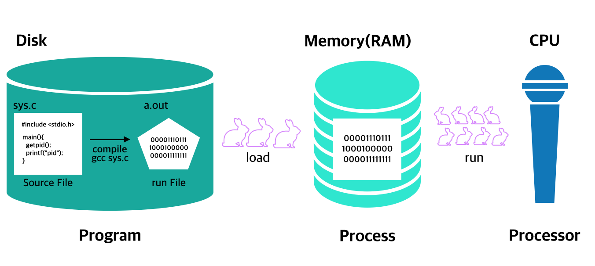
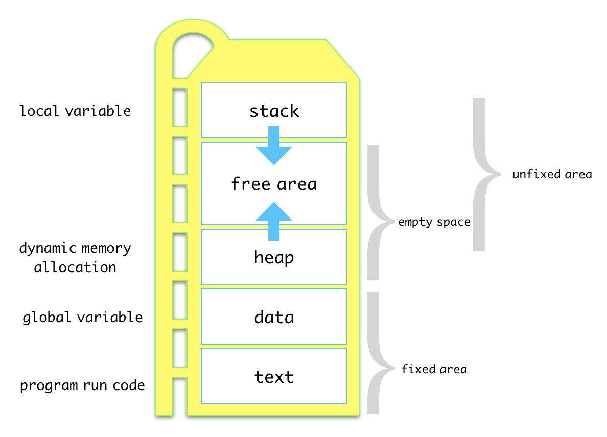
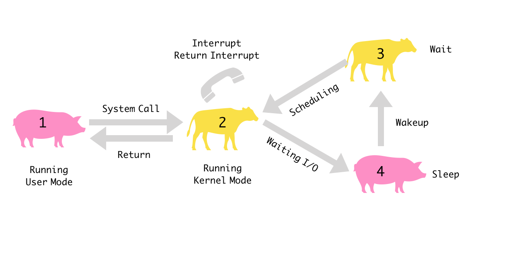
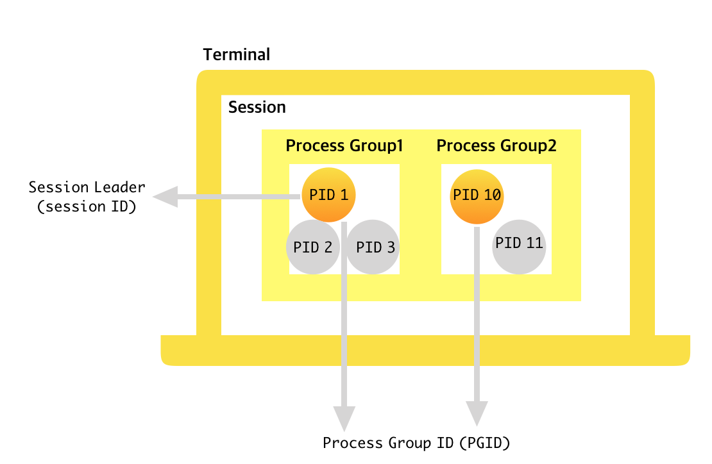

#5.프로세스 정보

 ##5-1.개요

***

프로세스(process)는 현재 실행중인 프로그램을 의미한다. 
유닉스 시스템에서는 동시에 여러 프로세스가 실행된다. 
프로세스는 계속 실행 상태에 있지 않으며, 실행에서 수면(Sleep), 실행대기등 규칙에 따라 여러 상태로 변한다.

현재 유닉스 시스템에서 실행 중인 프로세스를 확인하려면 `ps prstat, sdtprocess` 명령을 사용한다. 

시스템에서는 프로세스를 식별하는데 process ID(PID)를 사용한다. 
관련 프로세스들이 모여 process group을 구성한다. 

Session은 POSIX 표준에서 제안한 개념으로 사용자가 로그인해 작업하는 Terminal 단위로 프로세스 그룹을 묶은 것이다. 


프로세스를 식별할 때 사용할 수 있는 PID, 프로세스 그룹, 세션 관련 함수는 다음과 같다. 

|기능|함수원형|
|--|--|
|PID검색| pid_t getpid(void);|
|부모 PID검색| pid_t getpid(void);|
|프로세스 그룹 ID검색| pid_t getpgrt(void); pid_t getpgid(pid_t pid);|
|프로세스 그룹 ID변경| int setpgid(pid_t pid, pid_t pgid);|
|세션 리더 ID 검색| pid_t getsid(pid_t pid)|
|세션 생성| pid_t setsid(void);|

<br/><br/>
시간 정보를 이용해 프로세스의 실행시간을 측정할 수 있다. 
프로세스의 실행시간을 측정해 시스템 사용 요금을 결정하는데 활동할 수 있다. 
프로그램에서 특히 시간을 많이 소비하는 부분을 찾을 수 있다. 

프로세스의 실행 시간은 시스템 실행 시간과 사용자 실행 시간으로 구분할 수 있다. 
시스템 실행 시간은 프로세스에서 커널의 코드를 수행한 시간이고,
사용자 실행 시간은 사용자 모드에서 프로세스를 실행한 시간이다.

프로세스의 실행 시간을 측정하려면 times 함수를 사용한다. 

|기능|함수원형|
|--|--|
|프로세스 실행시간 측정| clock_t times(strct tms *buffer);|

<br/><br/>
모든 프로세스는 parent process 로부터 기본 환경을 물려받는다. 
enviroment variable을 사용하면 프로세스의 환경을 설정하거나 설정된 환경을 검색할 수 있다. 프로그램에서 환경 변수를 사용하는 방법으로는 전역 변수를 사용하는 방법, getenv함수를 사용하는 방법, main함수의 인자로 받는 방법이 있다.

|기능|함수원형|
|--|--|
|환경 설정 관련 전역 변수|extern char **environ;|
|환경 변수 검색| ` char *getenv(const char *name); `|
|환경 변수 설정 |` int putenv(char *string); ` ` int setenv(const char *envname, const char *envval, int overwrite);` ` int unsetenv(const char *name); ` |

<br/><br/>
 ##5-2.프로세스의 개념

***

일반적으로 유닉스 시스템에는 여러 사용자가 접속해 다양한 프로그램을 사용한다. 유닉스 운영체제 커널같은 시스템 프로그램도 동작한다. 
이렇게 현재 시스템에서 실행되고 있는 프로그램을 프로세스라고 한다. 
<br/><br/>

  ###5-2-1.프로세스의 정의

Process는 실행 중인 프로그램을 의미한다. 
프로세스를 프로그램이나 프로세서와 혼동하지 않아야한다. 
Processor는 인텔 펜티엄 4나 쿼드코어 같은 중앙처리장치(CPU, Central Processing Unit)을 의미한다. 
Program은 사용자가 컴퓨터에 작업을 시키기 위한 명령어의 집합으로 C언어와 같은 고급 언어나 Shell script 같은 스크립트 언어로 작성한다. 
<br/>
고급언어로 작성한 프로그램은 컴파일러를 통해 시스템이 이해할 수 있는 기계어(Machine language)프로그램으로 변환해야 한다. 
기계어로 변환된 프로그램을 ** 실행 프로그램/ 실행 파일 ** 이라고 한다.
<br/>
스크립트 언어로 작성한 프로그램은 사전에 실행파일로 만들어 놓지 않고, 실행시 코드를 읽고 해석해 실행한다. 
이렇게 실행하는 방식을 인터프리트(interpreted) 방식이라고 한다. 
<br/>
컴파일 방식으로 생성된 실행파일이든 인터프리트 방식으로 동작하는 스크립트 파일이든 상관없이 이를 실행하면 프로세스가 된다. 
프로세스는 프로세서가 처리중인 프로그램을 말한다. 
<br/>
프로그램 소스 파일을 작성한 후 컴파일해서 실행파일을 생성한다.
실행파일을 메모리에 적재(load)해서 실행하면 프로세스가 된다. 
이 프로세스를 처리하는 것이 프로세서이다. 
<br/>



<br/><br/>
  ###5-2-2.프로세스의 구조

프로그램을 실행하면 프로세스가 생성되는데, 메모리에 적재된 프로세스는 기본적으로 다음 그림과 같이 메모리가 할당된다. 
<br/>



<br/>
* 텍스트 영역(text section) : 실행 코드를 저장한다. 텍스트 영역은 프로세스 실행 중 크기가 변하지 않은 고정영역에 속한다.
* 데이터 영역(data section) : 프로그램에서 정의한 전역 변수를 저장한다. 전역 변수는 프로그램을 작성할 때 크기가 고정되므로 고정영역에 할당된다. 
* 힙(heap) : 프로그램 실행 중에 동적으로 메모리를 요청하는 경우에 할당되는 영역으로, 빈영역->할당->할당해제처럼 상태가 변하는 가변 영역이다.
* 스택(stack) : 프로그램에서 정의한 지역변수를 저장하는 메모리 영역으로, 지역 변수를 정의한 부분에서 할당해 사용한다.
* 빈 공간 : 스택이나 힙고 같이 가변적인 메모리 할당을 위해 유지하고 있는 빈 메모리 영역이다. 프로세스에 할당된 빈 메모리 영역이 모두 소진되면 메모리 부족으로 프로그램의 실행이 중단될 수 있다.

<br/><br/>
  ###5-2-3.프로세스 상태 변화

프로세스가 실행되는 동안 계속 실행상태에 있는 것은 아니다. 
프로세스의 상태는 규칙에 따라 여러 상태로 변한다. 
<br/>

<프로세스의 상태 및 전이>



 1. 프로세스는 먼저 사용자 모드에서 실행한다.
 2. 사용자 모드에서 시스템 호출을 하면 커널 모드로 전환되어 실행된다. 
 3. 수면 중이던 프로세스가 깨어나 실행 대기 상태로 전환되면 바로 실행할 수 있도록 준비한다.
 4. 커널모드에서 실행중 입출력 완료를 기다릴 때와 같이 더이상 실행을 계속 할 수 없을 때 수면 상태로 전환된다. 
<br/>
프로세스의 상태는 위의 그림에 있는 상태 중 하나가 된다. 
CPU는 한번에 한 프로세스만 실행할 수 있으므로 실제로는 시스템에서 실행중인 많은 프로세스 중 하나만 1번이나 2번 상태에 있고 나머지는 3번이나 4번 상태에 있게 된다. <br/>
만약 어떤 event가 발생하기를 기다릴 때, 즉 입출력 완료 혹은 다른 프로세스가 종료하기를 기다릴 때는 프로세스가 잠들고 이를 sleep 상태라고 한다. 
<br/>
수면 상태에서 기다리다가 해당 사건이 발생하면 깨어나 실행 대기 상태로 전환된다. 
실행 대기 상태는 CPU를 사용할 수 있을 때까지 기다리는 상태로 스케쥴링에 따라 실행된다. <br/> 
프로세스의 상태를 적절히 전환하는 일은 커널의 프로세스 관리 기능에 해당한다. 
<br/><br/>

  ###5-2-4.프로세스 목록 보기

현재 유닉스 시스템에서 실행중인 프로세스의 목록을 보려면 ps 명령을 사용한다.
아무 옵션없이 이 명령을 실행하면 현재 터미널에서 실행한 프로세스만 출력한다.
다음 예는 3번 가상 터미널(pseudo terminal)에서 콘 쉘(ksh, korn shell) 프로세스와 ps 프로세스가 동작하고 있음을 보여준다.<br/>

```

#ps

 PID TTY	TIME CMD
 678 pts/3 	0:00 ksh
 1766 pts/3	0:00 ps

* 시스템에서 실행중인 전체 프로세스를 보려면 -ef 옵션을 지정한다.

#ps -ef | more

```

솔라리스에서 ps 명령외에도  prstat 과 GUI 방식인 sdtprocess를 제공한다. 
GNU에서 제공하는 공개 명령인 top이 있다. 
<br/>
솔라리스용 top 명령은 http://www.sunfreeware.com 에서 구할 수 있다. 
<br/>
이들 명령은 현재 실행 중인 프로세스를 주기적으로 확인해 출력한다. 
<br/><br/>

 ##5-3. 프로세스 식별

***

사용자 계정에서 사용자를 식별하는 번호로 UID가 있는 것처럼, 프로세스도 프로세스를 식별하기 위한 프로세스ID(PID,Process ID)가 있다. 관련 프로세스 들이 모여 프로세스그룹(Process Group)을 구성한다. 
<br/>
  ###5-3-1.PID검색

PID는 0번부터 시작한다. 0번 프로세스는 스케쥴러(sched)로, 프로세스에 CPU 시간을 할당하는 역할을 한다. 0번 프로세스는 커널의 일부분이므로 별도의 실행파일은 없다. 1번프로세스는 init 이다. 
프로세스가 새로 생성될 때마다 기존 PID와 중복되지 않은 번호가 할당된다. 
<br/><br/>
* PID 검색 : getpid(2)
현재 프로세스의 PID를 검색하려면 getpid 함수를 사용한다. <br/>
리턴 값은 이 함수를 호출한 프로세스의 PID를 리턴한다.

```c 

#include <unistd.h>
pid_t getpid(void);

```
<br/><br/>
* PPID 검색 : getppid(2)

0번 프로세스를 제외하고, 모든 프로세스에는 자신을 생성한 프로세스가 있는데, 이를 부모 프로세스(Parent process)라고 한다. 부모 프로세스에도 당연히 PID가 있다. 부모 프로세스의 PID를 PPID(Prent process ID)라고 한다. 

```c

#include <unistd.h>
pid_t getppid(void);

```
<br/><br/>
* 현재 터미널에서 실행중인 프로세스 조회 명령 : ps

```

#ps

PID     TTY     TIME    CMD
678    pts/3    0:00    ksh    //콘쉘
2206   pts/3    0:00    ps

```

사용자가 프롬프트에서 실행 파일을 실행하면 쉘이 자식 프로세스(child process)를생성하고 이 프로세스가 실행 파일을 실행하도록 한다. 
<br/>
<br/>
  ###5-3-2.프로세스 그룹

프로세스 그룹(Process Group)은 관련있는 프로세스를 묶은 것으로 프로세스 그룹 ID(
PGID, Process Group ID)를 부여받는다. 프로세스는 프로세스 그룹을 구성하는 멤버가 된다. 프로세스 그룹은 BSD 계열 유닉스에서 작업(jop)제어를 구현하면서 도입했다. 
작업제어(job control)기능을 제공하는 C 쉘이나 콘 쉘은 Pipe로 연결함으로써 프로세스 그룹으로 묶어 한 작업으로 처리할 수 있다. 
<br/><br/>
* 프로세스 그룹 리더 

 프로세스 그룹을 구성하는 프로세스 중 하나가 그룹 리더가 되고, 프로세스 그룹 리더의 PID가 PGID가 된다. 프로세스의 그룹 리더는 변경될 수 있으며, 리더 프로세스가 변경되면 PGID도 변경된다. 
<br/><br/>
* PGID 검색 함수

```c

#include <unistd.h>
pid_t getpgrp(void);
pid_t getpgid(pid_t pid); // 인자가 0이면 이 함수를 호출한 프로세스가 속한 그룹의 PGID를 리턴한다.

* pid : PGID를 구하려는 프로세스의 ID

```
<br/><br/>
* PGID 변경 함수

```c

#include <sys/tpyes.h>
#include <unistd.h>

int setpgid(pid_t pid, pid_t pgid);

* pid: 프로세스 그룹에 속한 프로세스의 ID //pid 가 0 이면 현재 프로세스의 PID를 의미한다. 
* pgid : 새로지정할 PGID //pgid가 0이면 pid에 해당하는 프로세스가 그룹 리더가 된다. 

```
<br/><br/>
  ###5-3-3.세션

session은 POSIX 표준에서 제안한 개념으로 사용자가 로그인해 작업하고 있는 터미널 단위로 프로세스 그룹을 묶은 것이다. 
<br/>
프로세스 그룹은 관련있는 프로세스를 그룹으로 묶은 것이고,
세션은 관련있는 프로세스 그룹을 모은 개념이다. 
<br/>
프로세스, 프로세스 그룹, 세션의 관계는 다음과 같이 나타낼 수 있다. 
세션은 프로세스 그룹 단위로 작업 제어를 수행할 때 사용한다. 
<br/>

[프로세스, 프로세스 그룹, 세션의 관계]



<br/><br/>
* 세션 검색 : getsid(2)

```c

#include <unistd.h>
pid_t getsid(pid_t pid);

*pid : 자신이 속한 세션의ID를 구하려는 프로세스의 ID

```

이 함수는 pid 인자로 지정한 프로세사가 속한 세션의 ID를 리턴한다. 
pid가 0이면 현재 프로세스의 세션 ID를 리턴 한다. 
<br/><br/>
* 세션 생성 : setsid(2)

```c

#include <sys/types.h>
#include <unistd.h>

pid_t setsid(void);

```

새로운 세션을 만들수 있다. 
setsid를 호출하는 프로세스가 프로세스 그룹 리더가 아니면 새로운 세션을 만들고 세션 리더가 된다. <br/>
setsid 함수를 호출하는 프로세스가 프로세스 그룹 리더면 setsid  함수를 호출하지 않아도 된다. 

<br/><br/>
 ##5-4. 프로세스 실행 시간 측정

***

시간 정보를 이용해 프로세스의 실행 시간을 측정할 수 있다. 
프로세스를 실행하면 CPU나 메모리 같은 system resource를 사용하게 된다. 
<br/>
프로세스의 실행시간을 측정해 시스템의 사용요금을 결정하는데 활용할 수 있다. 
<br/>
또한 프로그램에서 많은 시간을 소비하는 부분을 찾아 개선하는데 활용할 수 있다. 
프로세스의 실행시간은 times함수를 사용해 측정할 수 있다. 
<br/>
프로세스의 실행시간은 커널 모드에서 실행한 시간과 사용자 모드에서 실행한 시간을 합해 구할 수 있다. 
<br/>
times함수는 커널 모드에서 실행한 시간과 사용자 모드에서 실행한 시간을 구분해서 알려준다. 

<br/><br/>
  ###5-4-1. 프로세스 실행 시간의 구성

프로세스의 실행 시간은 시스템 실행 시간과 사용자 실행 시간으로 나눌 수 있다.
<br/>

* 시스템 실행 시간
 프로세스에서 커널의 코드를 수행한 시간으로, 
시스템 호출로 소비한 시간을 의미한다. 
<br/>
* 사용자 실행 시간
 사용자 모드에서 프로세스를 실행한 시간으로, 
프로그램 내부의 함수나 반복문처럼 사용자가 작성한 코드를 실행하는데 걸린 시간이다. 
<br/>

` 프로세스 실행 시간 = 시스템 실행 시간 + 사용자 실행 시간 `

<br/><br/>
  ###5-4-2. 프로세스 실행 시간 측정

프로세스의 실행시간을 측정하는데는 times함수를 사용한다. 
이 함수를 사용하면 프로세스의 실행에 소요된 사용자 실행 시간과 시스템 실행 시간을 알 수 있다. 
<br/>
특히 모든 자식 프로세스의 실행시간을 함께 알 수 있다. 
<br/>
times 함수는 실행 결과를 tms구조체에 저장하고 ** 클록 틱 ** 을 리턴한다.
<br/><br/>
* tms 구조체 : sys/times.h 에 정의 되어 있다.

```c

strcut tms {
	clock_t tms_utime; //times함수를 호출한 프로세스가 사용한 사용자 모드 실행 시간
	clock_t tms_stime; //times함수를 호출한 프로세스가 사용한 시스템(커널) 모드 실행 시간
	clock_t tms_cutime; //times함수를 호출한 프로세스의 모든 자식 프로세스가 사용한 사용자 모드 실행 시간
	clock_t tms_cstime; // times 함수를 호출한 프로세스의 모든 자식 프로세스가 사용한 시스템 모드 실행시간

}

```
<br/><br/>
* 실행시간 측정 : times(2)

```c

#include <sys/times.h>
#include <limits.h>

clock_t times(struct tms *buffer);

* buffer : 실행 시간을 저장할 tms 구조체의 주소

```

times 함수는 프로세스의 실행 시간을 인자로 지정한 tms 구조체에 저장한다. <br/>
times함수가 알려주는 시간의 단위는 시계의 clock ticks이다. <br/>
이것은 limits.h 파일에 정의되어 있다. 
<br/>

<br/>
 ##5-5. 환경 변수의 활용

***

프로세스가 실행되는 기본 환경이 있다. 
<br/>
이 환경은 사용자의 login name, login shell, 터미널에 설정된 언어, pathname 등을 포함한다. <br/>
기본 환경은 환경 변수로 정의되어 있다. 모든 프로세스는 부모 프로세스에서 기본 환경을 물려 받는다. <br/>
쉘은 환경 변수를 검색, 추가, 수정 할 수 있도록 한다. <br/>
환경 변수는 전역변수 environ이나 getenv 함수로 검색하고, putenv 함수로 수정하거나 추가할 수 있다.  
<br/><br/>

  ###5-5-1. 환경변수의 이해

환경변수는 "환경변수명 = 값" 형태로 되어있으며, 환경변수명은 관례적으로 대문자를 사용한다. 환경변수는 쉘에서 값을 변경하거나 설정할 수 있으며, 함수를 이용해 읽거나 설정할 수 있다. <br/>
현재 쉘의 환경을 보려면 ` evn ` 명령을 사용한다. <br/>
언어 설정, 히스토리 크기, 로그인명, 로그인 쉘 등의 정보가 정의되어 있다. 
<br/><br/>

  ###5-5-2. 환경변수의 사용

프로그램에서 환경변수를 사용하는 방법으로는 전역 변수를 사용하는 방법, 
getenv 함수를 사용하는 방법, main함수의 인자로 받는 방법이 있다 
<br/><br/>

* 전역변수 사용 : environ

```c

#include <stdlib.h>
extren char **environ;

```

전역변수 environ은 환경 변수 전체에 대한 포인터이며 이 변수를 사용해 환경 변수를 검색할 수 있다. 

<br/><br/>

* 전역 변수 environ를 사용해 환경 변수 전체를 출력하는 예제

```c
#include <stdlib.h>
#include <stdio.h>

extern char **environ;

int main(void){
	char **env;
	env = environ;

	//environ의 주소를 임시 포인터인 env에 저장한다. 	
	while(*env){
		//env의 주소를 증가시키며 환경 변수를 출력한다.
		printf("%s\n", *env);
		env++;
	}
	
	return 0;
}
 
* 실행결과를 보면 첫번째 행에 출력된 실행 파일명 부분을 제외하면 env명령의 결과와 동일함을 알 수 있다. 

* main 함수 인자에 환경 변수에 대한 포인터를 받아서 출력할 수도 있다.

int main(int argc, char **argv, char **envp) {
... 위와 동일...

```

<br/><br/>
* main 함수 인자 사용

main 함수는 아무 인자 없이 사용할 수 있고, 인자를 지정할 수도 있다. <br/>
유닉스에서는 환경 변수를 세번째 인자로 지정해 사용할 수 있다. <br/>

` int main(int argc, char **argc, char **envp) {...} `

<br/><br/>

* 특정 환경 변수 검색 : getenv(3)

```c
#include <stdlib.h>
char *getenv(const char *name);

* name : 환경변수명

```
<br/><br/>

* 환경 변수 설정 및 삭제

```c
#include <stdlib.h>
int putenv(char *string);

*string: 설정할 환경변수와 값으로 구성할 문자열 ex) "SHELL=/usr/bin/csh"

int setenv(const char *envname, const char *envval, int overwrite);

*envname : 환경변수명
*envval : 값
*overwrite : 덮어쓰기

int unsetenv(const char *name); 

*name : 환경 변수명

```


