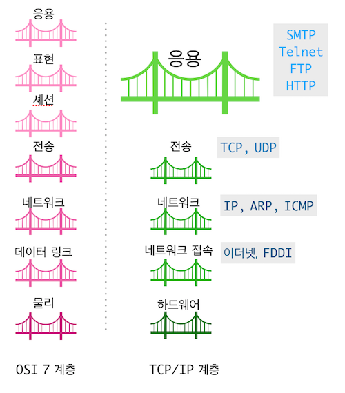
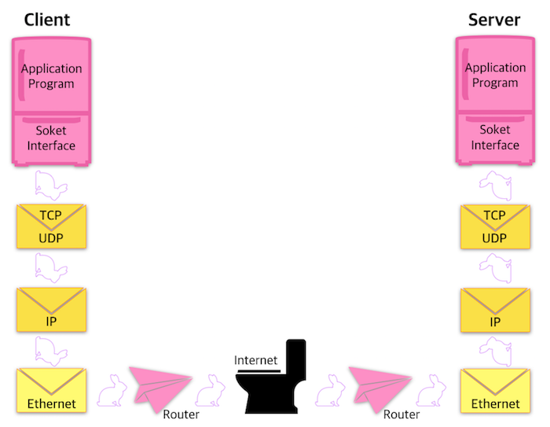
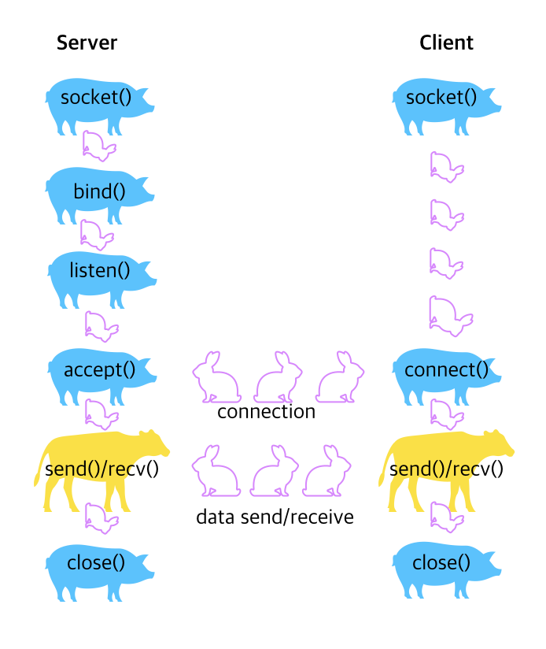

#11.소켓 프로그래밍 기초

 ##11-1.개요

***

TCP/IP Protocol은 인터넷의 확산으로 산업 표준으로 자리잡았다. <br/>
TCP/IP 프로토콜은 개발 초기부터 유닉스 시스템에 통합되어 서비스를 제공하고 있다.<br/>
이 프로토콜은 5개의 계층으로 이루어져 있다.<br/>
네트워크 계층 구조의 기준이라고 할 수 있는 ISO(International Standardization Organiztion)의 <br/>
OSI(Open System Interconnection) 7계층과 달리 이 프로토콜은 5개로 이루어져 있다.

[OSI 7계층과 TCP/IP 계층 구조 비교]



이중 하드웨어 계층과 네트워크 접속계층을 묶어서 4개의 계층으로 구분하기도 한다. 

 * Application layer : 사용자에게 서비스를 제공하기 위한 계층. 
 
 * Transport layer : 패킷의 전송을 담당하는 계층. TCP(Transmission Control Protocol)와 UDP(User Datagram Protocol)가 있다. 

 * Network layer : 인터넷 계층이라고도 하며, 패킷이 전달되는 경로를 담당한다. 통상 TCP/IP라고 부르는 프로토콜에서 IP(Internet Protocol)가 이 계층에 속한 프로토콜이다.  이 계층에는 ICMP, ARP도 있다. 

 * Network access layer 와 Hardware layer :  물리적인 네트워크와의 연결을 담당. 일반적으로 이더넷 카드나 랜카드라고 부르는 부분이 이 계층에 속한다. 

<br/><br/>

* TCP와 UDP의 차이점

|TCP|UDP|
|--|--|
|Connecion-oriented|Connectionless|
|reliability 보장| 보장안함|
|flow-control 제공| 흐름제어기능 없음|
|sequenced| 순서 보장 안함|


TCP는 전화를 걸때처럼 데이터를 주고 받기 전에 송신측과 수신측이 연결되어있어야한다. 그리고 송신데이터가 수신측에 도착했는지 확인하는 과정을 거친다. 
또한 데이터를 주고 받는 속도를 조절해 통신 효율이 떨어지거나 데이터가 손실되는 일을 방지할 수도 있다. 

UDP는 TCP와 달리 사전에 목적지와 연결을 설정하지도 않고, 상대방이 데이터를 제대로 수신했는지 확인도 안한다. 단순히 목적지 주소를 지정해 네트워크로 전송하는 것이다. 

중도에 데이터가 분실되어도 상관안한다. 

신뢰성보다는 속도가 중요한 서비스에 주로 이용한다. 예를 들어 Ping서비스의 경우 대상 호스트가 동작하는지를 빨리 알아내는 것이 중요하므로 UDP 프로토콜을 이용한다. 

 ** TCP/IP 계층구조를 구성하는 다양한 프로토콜 중에서 전송 계층의 TCP 프로토콜과 네트워크 계층의 IP 프로토콜이 대표적이기에 TCP/IP프로토콜이라고 부르고 있다. **

TCP/IP 를 이용해 데이터를 주고 받으려면 **  주소 ** 가 있어야한다.
일반 우편으로 편지를 보낼 때 주소를 적는 것과 마찬가지다. 

TCP/IP 프로토콜에서 주소 관련 프로토콜은 ** IP **이다.
 
TCP/IP 프로토콜을 이용하는 네트워크에서 주소는 IP 주소를 의미하며, (.)점으로 구분된 4바이트 정수로 표시된다. 192.168.100.1과 같이 쓴다. 

IP주소는 데이터가 전송될 목적지 호스트(destination host)를 알려주는 역할을 한다. 그런데 목적지 호스트에는 여러가지 기능을 수행하는 프로세스들이 동시에 동작하고 있을 수 있다. 

따라서 전송되어오는 데이터를 어느 프로세스가 수신해 서비스를 제공할 것인지를 알려줘야 한다. 이때 사용하는 것이 포트 번호(Port Number)이다. 포트 번호는 2바이트 정수로 되어있으므로 0~65535까지 사용할 수 있다. 

인터넷에서 자주 사용하는 서비스는 이미 포트 번호가 지정되어 있다. 
이를 잘 알려진 포트(Well-known port)라고 하며, 0~1023까지 사용한다.   

대표적인 포트 번호는 텔넷 프로토콜이 23
FTP가 21, HTTP가 80 등이다. 

일반 프로그램에서는 0~1023을 제외한 1024~65535를 사용하면 된다. 

TCP/IP 프로토콜을 이용해 응용 프로그램을 작성할 때 TCP 계층에서 제공하는 인터페이스 함수를 직접 사용해 프로그래밍하면 매우 복잡할 뿐 아니라 관련 프로토콜의 내부 구조를 잘 알고 있어야 한다. 

이런 복잡한 작업을 간편하게 해주는 것이 Socket Interface이다. 
소켓 인터페이스는 응용 계층에서 전송 계층의 기능을 사용할 수 있도록 제공하는 응용 프로그래밍 인터페이스 (API, Application Programming Interface)이다. 

소켓 인터페이스는 응용 프로그램과 TCP 계층을 연결하는 역할을 한다. 소켓 인터페이스를 이용하면 전송 계층이나 네트워크 계층의 복잡한 구조를 몰라도 쉽게 네트워크 프로그램을 작성할 수 있다. 
<br/>

[소켓 인터페이스를 이용한 통신구조]



<br/><br/>

 ##11-2.IP주소와 포트번호

***

TCP/IP 프로토콜을 이용해 통신하려면 IP주소와 인터넷에서 동작하는 각종 서비스를 구분하기 위한 포트 번호를 지정해야한다. 
<br/>
<br/>
  ###11-2-1. IP주소와 호스트명

IP주소는 인터넷을 이용할 때 사용하는 주소로, 점(.)으로 구분된 32비트 숫자로 표시한다. (192.168.100.51). IP주소를 네트워크 주소라고도 한다. 
<br/>
IP주소는 A~C클래스로 구분된다. <br/>
시스템은 주소를 숫자로 구분하는 것이 효율적이지만, 사람은 주소를 이름으로 구분하는 것이 더 편하다. <br/>

따라서 시스템에 IP주소 외에도 호스트명(hostname)을 지정한다. 
<br/>
인터넷에서 사용하는 호스트명은 '호스트명+도메인명'형태로 구성된다. 
<br/>
www.abc.co.kr 에서 www은 호스트명, abc.co.kr 은 도메인명이 된다.
<br/>
도메인 명은 도메인을 관리하는 기관에 등록하고 사용해야한다. <br/>
국내에서는 한국인터넷진흥원에서 kr도메인을 관리하고 있다.<br/> 
호스트명은 같은 도메인안에서 중복되지 않게 시스템 관리자가 정해 사용하면 된다. <br/>
호스트명과 도메인을 관리하는 시스템을 DNS(Domain Name System)이라고 한다. <br/>
<br/>
  ###11-2-2. 호스트명과 IP 주소 변환

호스트명과 IP주소를 등록해놓은 파일이나 데이터베이스를 검색해 호스트명이나 IP주소를 찾을 수 있다. <br/>
이와 관련된 파일은 /etc/hosts 이며, 데이터베이스로는 제공하는 서비스에 따라 DNS일 수도 있고, NIS(Network Information Service)일수도 있다. <br/>
/etc/nsswitch.conf 파일에 어떤 데이터베이스를 어떤 순서로 활용하는지 지정하고 있다. <br/>

예를 들어 /etc/nsswitch.conf에 지정된 값이 다음과 같다고 하자.

` hosts: files dns `

이 설정의 의미는 호스트명과 IP주소를 먼저 파일에서 찾고, 파일에서 찾지 못하면DNS서비스를 이용한다는 의미이다. <br/>

여기서 파일이란 /etc/hosts파일을 의미한다. <br/>
유닉스에서는 호스트명과 IP주소를 변환하는 함수를 여러가지 형태로 제공한다. 
<br/>

* host명과 IP 주소 읽어오기 

```c
#include <netdb.h>

struct hostent *gethostent(void);
int sethostent(int stayopen);
int endhostent(void);

* stayopen : IP주소 데이터베이스를 열어둘지 여부를 나타내는 값

```
 gethostent, sethostent, endhostent함수는 호스트명과 IP주소를 차례로 읽어온다 .<br/>
gethostent함수는 호스트명과 IP주소를 읽어서 hostent 구조체에 저장하고 그 주소를 리턴한다. <br/>
sethostent함수는 데이터베이스의 현재 읽기 위치를 시작부분으로 재설정한다. <br/>
sethostent함수는 gethostent함수를 처음 사용하기전에 호출해야한다. <br/>
sethostent함수의 인자인 stayopen값이 0이 아니면 데이터베이스가 열린채로 둔다.<br/> endhostent함수는 데이터베이스를 닫는다. <br/>
gethostent함수는 데이터베이스의 끝을 만나면 널을 리턴한다. <br/>
sethostent함수와 endhostent 함수는 수행을 성공하면 0을 리턴한다. 
<br/>

* hostent구조체 (netdb.h)

```c

struct hostent{
	char *h_name; //호스트명
	char **h_aliases; //호스트명을 가리키는 다른 이름들
	int h_addrtype; //호스트 주소의 형식
	int h_length; //주소의 길이
	char **h_addr_list; //해당 호스트의 주소목록을 저장한다. 
}
```
<br/><br/>

* host명으로 정보 검색 

```c
#include <netdb.h>
struct hostent *gethostbyname(const char *name);

*name : 검색하려는 호스트명
```

gethostbyname함수는 호스트명을 인자로 받아 데이터베이스에서 해당 항목을 검색해  hostent구조체에 저장하고 그 주소를 리턴한다. 

<br/>

* IP주소로 정보 검색 : gethostbyaddr(3)

```c
#include <netdb.h>
struct hostent *gethostbyaddr(const char *addr, int len, int type);

* addr : 검색하려는 IP주소
* len : addr 길이
* type : IP 주소 형식

```
이 함수는IP주소를 인자로 받아 데이터베이스에서 해당항목을 검색해서 hostent 구조체에 저장하고 그 주소를 리턴한다. <br/>
addr에 저장되는 주소는 변환을 수행한 것이다. 세번째 인자인 type에는 주소의 형식으로 sys/socket.h 파일에 정의된 주소형식을 사용하며 주로 AF_UNIX(호스트 내부 통신), AF_INET(인터네트워크 통신: UDP, TCP)을 사용한다. <br/>
<br/>

  ###11-2-3. 포트 번호

IP주소는 데이터가 전송될 목적지 호스트를 알려주는 역할을 한다. <br/>
목적지 호스트에는 여러 기능을 수행하는 서비스 프로세스들이 동시에 동작하고 있을 수 있다. <br/>
웹서비스, 메일서비스, FTP서비스, 텔넷서비스 등을 수행하는 프로세스들이 동작하고 있는 것이다. <br/>
따라서 전송되어 오는 데이터를 어느 서비스 프로세스에 전달할 것인지 구분할 수 있어야 한다. <br/>
마치 회사 주소로 배달된 우편물을 전산실 김대리에게 전달하려면 회사 주소 뿐 아니라 수신자명이 정확하게 있어야 하는 것과 마찬가지다. <br/>
인터넷에서도 IP주소 외에 서비스를 구분하는 다른 정보가 필요하다. 
<br/>
이때 사용하는 것이 포트 번호다. <br/>
포트 번호(port number)는 2바이트 정수로 되어 있으므로 0~65535까지 사용할 수 있다. <br/>
인터넷에서 자주 사용하는 서비스는 이미 포트번호가 지정되어 있다.<br/>
이를 well-known port라고 하며 0~1023 까지 사용한다. <br/>
대표적인 포트번호는 텔넷 프로토콜이 23, FTP가 21, HTTP가 80 등이다. <br/>
일반 프로그램에서는 0~1023 을 제외한 1024~65535를 사용하면 된다. <br/>
이미 정해진 포트 번호는 /etc/services 파일에 등록되어 있다. <br/>
물론 유닉스는 /etc/service 파일에서 정보를 검색하는 함수를 제공한다.  <br/>

<br/>

* 포트 정보 읽어오기

```c
#include <netdb.h>
struct servent *getservent(void);
int setservent(int stayopen);
int endservent(void);

* statyopen : 포트 정보 데이터베이스를 열어둘지 여부를 나타내는 값

```

이 함수들은 포트정보를 차례로 읽어온다. 이 함수들은 gethostent, sethostent, endhostend함수와 같은 형태로 동작한다. <br/>

* servent 구조체는 netdb.h에 정의되어 있다 

```c
struct servent{
	char *s_name; //포트명 
	char **s_aliases; //해당 서비스를 가리키는 다른 이름들을 저장함
	int s_port; //포트번호
	char *s_proto; //서비스에 사용하는 프로토콜의 종류
};

```

<br/><br/>

* 서비스명으로 정보 검색

```c
#include <netdb.h>
struct servent *getservbyname(const char *name, const char *proto);

* name: 검색할 포트명
* proto : 'tcp' 또는 'udp' (또는 NULL)

```

이 함수는 포트명을 인자로 받아 데이터베이스에서 해당 항목을 검색해 servent 구조체에 저장하고 그 주소를 리턴한다. 두번째 인자에는 tcp나 udp 또는 NULL을 지정한다.같은 서비스 포트가 TCP 서비스를 위한 번호와 UDP 서비스를 위한 번호로 구분되기 때문이다. 

<br/><br/>

* 포트 번호로 정보 검색

```c
#include <netdb.h>
struct servent *getservbyport(int port, const char *proto);

* port: 검색할 포트 번호
* proto : tcp 또는 udp

```

이 함수는 포트 번호를 인자로 받아 데이터베이스에서 항목을 검색해 servent 구조체에 저장하고 그 주소를 리턴한다. <br/><br/>

 ##11-3.소켓 프로그래밍 기초

***

소켓은 응용 계층과 전송 계층을 연결하는 기능을 제공하는 프로그래밍 인터페이스이다. <br/>
소켓을 이용해 TCP/IP  환경에서 프로그래밍할 경우, TCP나 UDP 프로토콜에 대해 세부적인 지식이 없어도 통신 프로그램을 작성할 수 있다. <br/>
<br/>

  ###11-3-1.소켓의 종류

소켓(socket)은 크게 두가지로 구분되는데, 같은 호스트에서 프로세스 사이에 통신할 때 사용하는 유닉스 도메인 소켓과 인터넷을 통해 다른 호스트와 통신할 때 사용하는 인터넷 소켓이 있다. <br/>

이 소켓들을 표시하는 이름으로는 sys/socket.h 에 정의되어 있는 주소 패밀리명을 사용한다. <br/>

  * AF_UNIX : 유닉스 도메인 소켓<br/>
  * AF_INET : 인터넷 소켓
<br/><br/>
  ###11-3-2. 소켓의 통신 방식

TCP/IP 프로토콜에서 전송 계층에서 사용하는 프로토콜로는 TCP와 UDP가 있다. <br/>
소켓을 이용할 때도 하부 프로토콜로 TCP를 사용할 것인지 UDP 를 사용할 것인지를 지정해야한다. <br/> 이는 미리 지정되어있는 상수를 사용해 지정한다. 

  * SOCK_STREAM :  TCP 프로토콜 사용<br/>
  * SOCK_DGRAM : UDP 프로토콜 사용 <br/>

<br/>
따라서 소켓을 이용할 때는 소켓의 종류와 통신 방식에 따라 4가지 통신 유형이 나타난다. <br/>

  * AF_UNIX - SOCK_STREAM
  * AF_UNIX - SOCK_DGRAM
  * AF_INET - SOCK_STREAM
  * AF_INET - SOCK_DGRAM

<br/><br/>

  ###11-3-3.소켓 주소 구조체

소켓을 이용한 프로그래밍에서는 소켓의 종류와 IP주소, 포트번호를 지정하기 위한 구조체를 이용한다. <br/> 소켓 구조체는 유닉스 도메인 소켓과 인터넷 소켓에서 각기 다른 형태를 사용한다. <br/>
<br/>
* 유닉스 도메인 소켓의 주소 구조체

유닉스 도메인 소켓에 사용하는 주소 구조체는 다음과 같다. <br/>
sockaddr_un구조체는 sys/un.h에 정의되어 있다. sockaddr_un구조체는 주소패밀리명과 경로명이 들어있다. <br/> sun_famaily에는 AF_UNIX를 지정한다. 

```c
struct sockaddr_un{
	sa_family_t sun_family;
	char	sun_path[108];
}

```

<br/><br/>

* 인터넷 소켓의 주소 구조체 

인터넷 소켓에 사용하는 주소 구조체는 다음과 같다. 주소 패밀리명과 포트번호, IP주소가 구조체 항목으로 들어있다. 

```c
struct sockaddr_in{
	sa_family_t     sin_family;
	in_port_t	sin_port;
	struct in_addr	sin_addr;
};

struct in_addr{
	in_addr_t 	s_addr; //32비트 IP주소(long)
};

```
<br/><br/>

  ###11-3-4. byte ordering 함수

컴퓨터에서 정수를 저장하는 방식(byte ordering)은 두가지로, 각각 바이트를 순서대로 저장하는 big endian과 거꾸로 저장하는 little endian이다. <br/>

big endian 방식은 메모리의 낮은 주소에 정수의 첫바이트를 위치시킨다. <br/>
0x1234를 저장할 경우, 이 방식은 0x12, 0x34의 순서대로 저장한다. (최상위 바이트 우선, most significant byte first). <br/>

little endian 방식은 메모리의 높은 주소에 정수의 첫 바이트를 위치시킨다.<br/>
따라서 0x1234를 저장하면 0x34, 0x12의 순서와 같이 거꾸로 저장한다.(최하위 바이트 우선, least significant byte first).  <br/>
인텔 계열은 little endian 방식, 모토롤라(680x0)와 SPARC은 big endian방식을 사용한다. <br/>
컴퓨터마다 바이트를 저장하는 순서가 다르기 때문에 네트워크를 이용한 통신에서 바이트순서는 주요 문제가 된다. <br/>
데이터를 보내는 컴퓨터와 받는 컴퓨터의 정수 저장 방식이 다르면 같은 값을 서로 다르게 해석하기 때문이다. <br/>
TCP/IP에서는 데이터를 전송할 때 무조건 big endian을 사용하기로 결정했다.<br/>
이를 NBO(Network Byte Order)라고 한다. <br/>

호스트에서 사용하는 바이트 순서는 HBO(Host Byte Order)라고 한다. <br/>
시스템에서 통신을 통해 데이터를 내보낼 때에는 HBO에서 NBO로 순서를 바꿔서 전송하고, 데이터를 받으면 NBO에서 HBO로 데이터 순서를 변환한 후 처리해야한다. <br/>
NBO와 HBO간에 바이트 순서를 변환해주는 함수를 사용해 이 작업을 수행할 수 있다. 

```c
#include <sys/type.h>
#include <sys/netinet/in.h>
#include <inttypes.h>

uint32_t htonl(unit32_t hostlong); //32비트 HBO를 32비트 NBO로 변환.
uint16_t htons(unit16_t hostshort);//16비트 HBO를 16비트 NBO로 변환  
uint32_t ntohl(unit32_t netlong);  //32비트 NBO를 32비트 HBO로 변환
uint16_t ntohs(unit16_t netshort); // 16비트 NBO를 16비트 HBO로 변환

* hostlong , hostshort :  호스트 바이트 순서로 저장된 값
* netlong, netshort : 네트워크 바이트 순서로 저장된 값

```
이 함수들은 socket 라이브러리에 정의되어 있다. 
<br/><br/>

  ###11-3-5. IP 주소 변환 함수

IP주소는 192.168.0.1과 같이 (.)으로 구분되는 형태다. 이 주소를 저장할 때 두가지 방법이 있다. <br/>
시스템 내부적으로는 앞서오 같은 형태의 주소를 이진값으로 바꿔서 저장한다. <br/>
외부적으로 사용할 때는 문자열로 사용한다. <br/>
따라서 이진값과 문자열로 표시되는 IP주소를 서로 변환할 수 있는 함수를 제공한다. 
<br/><br/>

* 문자열 형태의 IP주소를 숫자 형태로 변환

```c
#include <sys/type.h>
#include <sys/socket.h>
#include <netinet/in.h>
#include <arpa/inet.h>

in_addr_t inet_addr(const char *cp);

* cp : 문자열 형태의 IP주소

```

이 함수는 IP주소를 문자열로 받아 이를 이진값으로 바꿔서 리턴한다. <br/>
in_addr_t는 long형이다. 

<br/><br/>

* 구조체 형태의 IP 주소를 문자열 형태로 변환 

```c
#include <sys/types.h>
#include <sys/socket.h>
#include <netinet/in.h>
#include <arpa/inet.h>

in_addr_t inet_addr(const char *cp);

* cp : 문자열 형태 IP 주소

```

이 함수는 IP주소를 문자열로 받아 이를 이진값으로 바꿔서 리턴한다. 

<br/><br/>

* 구조체 형태의 IP주소를 문자열 형태로 변환 

```
#include <sys/types.h>
#include <sys/socket.h>
#include <netinet/in.h>
#include <arpa/inet.h>

char *inet_ntoa(const struct in_addr in);

* in: in_addr 구조체 형태 IP주소

```

이 함수는 IP주소를 in_addr 구조체 형태로 받아 점으로 구분된 문자열로 리턴한다. 
<br/><br/>

 ##11-4. 소켓 인터페이스 함수

***

socket도 special file의 하나이다. 따라서 소켓을 이용해 네트워크 프로그래밍을 할 때는 소켓을 생성해 IP주소와 연결한 후 서버와 클라이언트가 연결되면 소켓을 통해 읽고 쓰면 된다. <br/>

<br/>
  ###11-4-1. 소켓 인터페이스 함수

소켓을 이용해 네트워크 프로그래밍을 할 때 필요한 함수는 다음과 같다. 

   * socket : 소켓 파일 기술자 생성 <br/>
   * bind : 소켓 파일 기술자를 지정된 IP주소/포트 번호와 결합(bind) <br/>
   * listen : 클라이언트의 접속 요청 대기<br/>
   * connect : 클라이언트가 서버에 접속 요청<br/>
   * accept : 클라이언트의 접속 허용 <br/>
   * recv : 데이터 수신 ( SOCK_STREAM ) <br/>
   * send : 데이터 송신 (SOCK_STREAM) <br/>
   * recvfrom : 데이터 수신 (SOCK_DGRAM) <br/>
   * sendto : 데이터 송신(SOCK_DGRAM) <br/>
   * close  : 소켓 파일 기술자 종료 <br/>

이들 함수 중 bind, listen, accept 는 서버측에서만 사용한다.<br/>
반면 connect 함수는 클라이언트측에서만 사용한다. <br/>
나머지 socket, recv, send, recvfrom, sendto, close 함수는 서버와 클라이언트 모두 사용한다. 

* 소켓 생성하기 

```c
#include <sys/types.h>
#include <sys/socket.h>
int socket(int domain, int type, int protocol);

* domain : 소켓 종류 (유닉스 도메인 또는 인터넷 소켓)
* type  : 통신 방식 (TCP or UDP)
* protocol : 소켓에 이용할 프로토콜

```
socket 함수는 domain에 지정한 소켓의 형식과 type에 지정한 통신 방식을 지원하는 소켓을 생성한다. <br/>
protocol은 소켓에서 이용할 프로토콜로, 보통은 0을 지정한다. <br/>
이 경우 시스템이 protocol 값을 결정한다. <br/>
domain에는 도메인 또는 주소 패밀리를 지정한다. <br/>
유닉스 도메인 소켓을 생성할 경우 AF_UNIX를 지정하고, 인터넷 소켓을 생성할 경우 AF_INET을 지정한다. <br/>
type에는 통신 방식에 따라 SOCK_STREAM이나 SOCK_DGRAM을 지정한다. <br/>
socket함수는 성공하면 소켓 기술자를, 실패시 -1을 리턴한다. 

```c
<인터넷 소켓 생성 예시>

int sd;
sd = socket(AF_INET, SOCK_STREAM, 0);

```
<br/><br/>

* 소켓에 이름 지정하기 : bind(3)

```c
#include <sys/types.h>
#include <sys/socket.h>
int bind(int s, const struct sockaddr *name, int namlen);

* s: socket함수가 생성한 소켓 기술자
* name : 소켓의 이름을 표현하는 구조체
* namelen: name의 크기

* 성공시 0, 실패시 -1 리턴

<bind함수로 소켓에 이름을 붙이는 예>
* IP주소를 192.168.100.1로 지정하고, 포트 번호를 9000번으로 지정함

int sd;
struct sockaddr_in sin;

memset((char *)&sin, '\0', sizeof(sin));
sin.sin_family = AF_INET;
sin.sin_port = htons(9000);
sin.sin_addr.s_addr = inet_addr("192.168.100.1");
memset(&(sin.sin_zero), 0, 8);

bind(sd, (struct sockaddr *)&sin, sizeof(struct sockaddr));

```

<br/><br/>
* 클라이언트 연결 기다리기 : listen(3)

```c
#include <sys/types.h>
#include <sys/socket.h>
int listen(int s, int backlog);

* s : socket함수가 생성한 소켓 기술자
* backlog : 최대 허용 클라이언트 수

<클라이언트 연결요청을 받아들일 준비를 마쳤고, 최대 10개까지만 연결을 받겠다고 표현한 예>

listen(sd,10);

```

<br/><br/>
* 연결 요청 수락하기 :  accept(3)

```c
#include <sys/types.h>
#include <sys/socket.h>
int accept(int s, struct sockaddr *addr, socklen_t *addrlen);

* s : socket함수가 생성한 소켓 기술자
* addr : 접속을 수락한 클라이언트의 IP정보
* addrlen : addr크기

<기존 소켓 기술자 sd를 통해 연결이 수락되면 새로운 기술자 new_sd가 리턴된다. clisin에는 클라이언트 주소가 리턴된다.>

int sd, new_sd;
struct sockaddr_in sin, clisin;

new_sd = accept(sd, &clisin, &sizeof(struct sockaddr_in));

```

<br/><br/>
* 서버와 연결하기 : connect(3)

```c
#include <sys/types.h>
#include <sys/socket.h>

int connect(int s, const struct sockaddr *name, int namelen);

* s : socket 함수가 생성한 소켓 기술자
* name : 접속하려는 서버의 IP 정보
* namelen : name의 크기

<IP주소가 192.168.100.1인 서버에 9000번 포트로 연결하는 예>

int sd;
struct sockaddr_in sin;

memset((char *)&sin, '\0', sizeof(sin));
sin.sin_family = AF_INET;
sin.sin_port = htons(9000);
sin.sin_addr.s_addr = inet_addr("192.168.100.1");
memset(&(sin.sin_zero), 0, 8);

connect(sd, (struct sockaddr *)&sin, sizeof(struct sockaddr));

```

<br/><br/>
* 데이터 보내기 : send(3)

```c
#include <sys/types.h>
#include <sys/socket.h>
ssize_t send(int s, const void *msg, size_t len, int flags);

* s : socket 함수가 생성한 소켓 기술자
* msg: 전송할 메세지를 저장한 메모리 주소
* len : 메시지의 크기
* flags : 데이터를 주고받는 방법을 지정한 플래그
   - MSG_OOB: out-of-and data  (영역밖의 데이터)로 처리한다. 
     이는 SOCK_STREAM에서만 사용할 수 있다. 
     영역밖의 데이터란 중요한 메세지가 아니란 의미이다. 
     이 플래그를 설정한 메시지를 보내고 수신 확인을 받지 않아도 다른 메시지를  
     계속 전송한다. 

   - MSG_DONTROUTE: 데이터의 라우팅 설정을 해제한다.  
     이 플래그는 진단 프로그램이 아니라 라우팅 프로그램에서 사용한다. 


* 성공시 실제로 전송한 데이터의 바이트 수를 리턴, 
  리턴값이 보낸 데이터 크기보다 작으면 모두 보내지 못했다.
  실패시 -1 리턴.
 
<간단한 메세지 전송 예시>

char *msg = "send test\n";
int len = strlen(msg)+1;

if(send(sd, msg, len, 0) == -1) {
	perror("send");
 	exit(1);
}
```

<br/><br/>
* 데이터 받기 : recv(3)

```c
#include <sys/types.h>
#include <sys/socket.h>
ssize_t recv(int s, void *buf, size_t len, int flags);

* s : socket 함수가 생성한 소켓 기술자
* buf : 전송받은 메시지를 저장할 메모리 주소
* len : buf의 크기
* flags : 데이터를 주고 받는 방법을 지정한 플래그

<버퍼의 크기글 80으로 설정하고 데이터를 수신하는 예>

char buf[80];
int len, rlen;

if((rlen = recv(sd, buf, len, 0)) == -1) {
	perror("recv");
	exit(1);
}

```

recv 함수는 소켓 s 를 통해 전송 받은 메세지를 크기가 len인 버퍼 buf에 저장한다. 
<br/>
마지막 인자인 flags는 send함수에서 사용하는 플래그와 같다. <br/>
recv함수는 실제로 수신한 데이터의 바이트 수를 리턴한다. <br/>


<br/><br/>
* 데이터 보내기 : sendto(3)

```c
#include <sys/types.h>
#include <sys/socket.h>

ssize_t sendto(int s, const void * msg, size_t len, int flags, const struct sockaddr *to, int tolen);

* s: socket함수가 생성한 소켓 기술자
* msg: 전송할 메시지를 저장한 메모리 주소
* len: 메시지의 크기
* flags: 데이터를 주고 받는 방법을 지정한 플래그
* to : 메세지를 받을 호스트의 주소
* tolen : to의 크기

<IP주소가 192.168.0.1인 서버로 데이터를 전송하는 예>

char *msg = "send test\n";
int len = strlen(msg) +1;
struct sockaddr_in sin;
int size = sizeof(struct sockaddr_in);

memset((char *)&sin, '\0', sizeof(sin));
sin.sin_family = AF_INET;
sin.sin_port = htons(9000);
sin.sin_addr.s_addr = inet_addr("192.168.0.1");
memset(&(sin.sin_zero), 0, 8);

if(sendto(sd, msg, len, 0, (struct sockaddr *)&sin, size) == -1) {
	perror("sendto");
	exit(1);
}

```
이 함수는 UDP 프로토콜로 데이터를 전송하는 함수다.<br/>
 따라서 목적지까지 미리 경로를 설정하지 않고 데이터를 전송한다.<br/>
 데이터그램 기반 소켓(SOCK_DGRAM)으로 통신을 할 때는 listen이나 accept함수를 호출하지 않는다.<br/> 첫번째 인자인 s로 지정한 소켓을 통해 msg가 가리키는 데이터를 to가 가리키는 목적지의 주소로 전송한다.<br/>
 send 함수와 달리 매번 목적지 주소를 지정해야한다.<br/>
 sendto 함수는 실제로 전송한 데이터의 바이트 수를 리턴한다. 

<br/><br/>
* 데이터 받기 : recvfrom(3)

```c
#include <sys/types.h>
#include <sys/socket.h>
ssize_recvfrom(int s, void *buf, size_t len, int flags, struct sockaddr *from, int *fromlen);

* s : socket함수가 생성한 소켓 기술자
* buf : 전송받은 메시지를 저장할 메모리 주소
* len : 메시지의 크기
* flags : 데이터를 주고 받는 방법을 지정한 플래그
* from : 메시지를 보내는 호스트의 주소
* fromlen : from의 크기


<서버에서 전송한 데이터를 읽어오는 예>

char buf[80];
int len, size;
struct sockaddr_in sin;

if(recvfrom(sd, buf, len, 0, (struct sockaddr *)&sin, &size) == -1) {
	perror("recvfrom");
	exit(1);

}

```
이 함수는 UDP 프로토콜로 전달된 데이터를 수신하는데 사용한다. <br/>
따라서 어디에서 메시지를 보내온 것인지 주소 정보도 함께 전달받는다. <br/>
다섯번째 인자인 from에는 메시지를 발신한 시스템의 주소 정보가 저장된다. <br/>
이 함수는 실제로 읽어온 데이터의 바이트 수를 리턴한다. <br/>

<br/><br/>
* 소켓 함수의 호출 순서 

소켓 관련 함수를 호출하는 일반적인 순서는 다음의 그림과 같다. <br/>
서버측에서는 socket 함수로 먼저 소켓을 생성한 후 bind함수를 사용해 특정 포트와 연결한다. <br/> 
그후 클라이언트에서 오는 요청을 받을 준비를 마쳤다는 사실을  listen함수를 통해 운영체제에 알리고, 요청이 들어오기를 기다린다. <br/>
클라이언트의 요청이 오면 accept함수로 요청을 받고, send와 recv함수를 통해 데이터를 주고받는다. <br/>
클라이언트의 경우 socket함수로 소켓을 만든 뒤 connect 함수로 서버와 연결을 요청한다. <br/>
서버에서 연결 요청을 받아들이면 send와 recv 함수로 데이터를 주고 받는다. <br/>
서버와 클라이언트 모두 close함수를 사용해 통신을 종료한다. <br/>
<br/>
[소켓함수의 호출 순서]



<br/><br/>

 ##11-5. 소켓 프로그래밍 예제

***

이 절에서는 소켓을 이용한 간단한 프로그램을 작성해본다. <br/>
소켓에는 같은 시스템에 있는 프로세스끼리 데이터를 주고 받을 때 사용하는 유닉스 도메인 소켓과 다른 시스템의 프로세스와 통신을 하는 인터넷 소켓이 있다. <br/>


  ###11-5-1. 유닉스 도메인 소켓 예제

유닉스 도메인 소켓은 같은 시스템에서 통신이 일어나므로 TCP/IP 프로토콜을 직접 이용할 필요가 없다. 
<br/>
유닉스 도메인 소켓에서 사용하는 소켓 주소 구조체의 항목도 IP주소가 아닌 경로명을지정하도록 되어 있다. <br/>
이는 파이프나 시스템V IPC에서 특수 파일을 통신에 사용하는 것과 같다고 생각하면 된다. <br/>
소켓 주소 구조체의 항목이 다른 것을 제외하면 유닉스 도메인 소켓이든 인터넷 소켓이든 소켓 함수를 사용하는 방식은 동일하다. <br/>

이번 예제는 서버와 클라이언트 프로그램으로 나뉜다. 
<br/>
* 서버 프로그램은 hbsocket이라는 이름으로 소켓을 생성한 후 클라이언트의 접속을 기다리다가 클라이언트가 접속하면 보내온 메시지를 읽어 출력하는 간단한 구조이다. 
<br/>

```c

#include <sys/types.h>
#include <sys/socket.h>
#include <unistd.h>
#include <stdlib.h>
#include <stdio.h>
#include <string.h>

#define SOCKET_NAME "hbsocket"

int main(void){
	char buf[256];
	struct sockaddr_un ser, cli;
	int sd, nsd, len, clen;

	//소켓을 생성하고, 소켓 주소 구조체에 값을 지정한다.
	if((sd = socket(AF_UNIX, SOCK_STREAM, 0)) == -1){
		perror("socket");
		exit(1);
	}

	memset((char *)&ser, 0, sizeof(struct sockaddr_un));
	//소켓 패밀리를 AF_UNIX로 지정하고 소켓 경로명을 지정한다.
	ser.sun_family = AF_UNIX;
	strcpy(ser.sun_path, SOCKET_NAME);
	len = sizeof(ser.sun_family)+strlen(ser.sun_path);
	
	//bind함수로 소켓 기술자를 소켓주소 구조체와 연결해 이름을 등록한다.
	if(bind(sd,(struct sockaddr *)&ser, len)) {
		perror("bind");
		exit(1);
	}
	
	//listen함수를 호출해 통신할 준비를 마쳤음을 알린다. 
	if(listen(sd, 5) <0){ 
		perror("listen");
		exit(1);
	}

	printf("waiting ... \n");

	//accept함수를 호출해 클라이언트의 접속요청을 수락하고 새로운 소켓 기술자를 생성해 nsd에 저장한다.
	if((nsd = accept(sd, (struct sockaddr *)&cli, &clen)) == -1) {
		perror("accept");
		exit(1);
	}
	
	//recv함수로 클라이언트가 보낸 메시지를 받아서 출력한다.
	if(recv(nsd, buf, sizeof(buf), 0) == -1) {
		perror("recv");
		exit(1);
	}

	printf("received message: %s/n", buf);

	//소켓을 닫는다.
	close(nsd);
	close(sd);

	return 0;
}

```

<br/><br/>


* 클라이언트 실행 프로그램은 hbsocket이라는 이름으로 소켓을 생성한 후 
서버측과 연결해 메세지를 전송하는 프로그램이다.

```c

<유닉스 도메인 소켓(클라이언트)>

#include <sys/types.h>
#include <sys/socket.h>
#include <unistd.h>
#include <stdlib.h>
#include <string.h>

#define SOCKET_NAME "hbsocket"

int main(void) {
	int sd, len;
	char buf[256];
	struct sockaddr_un ser;
	
	//소켓을 생성하고 소켓 주소 구조체에 값을 지정한다.	
	if((sd== socket(AF_UNIX, SOCK_STREAM, 0)) == -1) {
		perror("socket");
		exit(1);
	}

	memset((char *)&ser, '\0', sizeof(ser));
	ser.sun_family = AF_UNIX;
	strcpy(ser.sun_path , SOCKET_NAME);
	len = sizeof(ser.sun_family) _strlen(ser.sun_path);
	
	//소켓 주소 구조체에 지정한 서버로 connect함수를 사용해 연결을 요청한다.
	if(connect(sd, (struct sockaddr *)&ser, len) <0){
		perror("bind");
		exit(1);
	}

	strcpy(buf, "Unix Domain Socket Test Message");
	//서버로 메세지를 전송한다. 
	if(send(sd, buf, sizeof(buf), 0) == -1) {
		perror("send");
		exit(1);
	}
	close(sd);
	return 0;
}

* 이 실행프로그램을 한번 실행 후 다시 실행시 다음과 같은 메세지가 출력된다.

bind : Address already in use

이는 소켓 파일이 이미 있다는 의미이다. 따라서 소켓 파일을 미리 삭제하거나 
서버 프로그램에서 소켓을 생성하기전에 unlink(SOCKET_NAME); 을 호출해서 
파일을 지우도록 프로그램해야한다. 

* 이 프로그램은 소켓 라이브러리를 지정(-lsocket)해 컴파일 해야한다. 


```

  ###11-5-2. 인터넷 소켓 예제

인터넷 소켓은 서로 다른 시스템 사이에 통신하므로 TCP/IP 프로토콜을 직접 이용한다. <br/>
따라서 소켓 주소 구조체의 항목에 IP주소와 포트번호를 지정해야한다.<br/>

다음의 예제는 서버에서 클라이언트로 메시지를 보내도록 한다. <br/>
메시지의 내용은 서버에 접속한 클라이언트의 주소를 알려주는 것이다. <br/>

이번 예제의 서버 프로그램은 소켓을 생성한 후 IP주소와 연결하고 클라이언트의 접속을 기다리다가, 클라이언트가 접속하면 클라이언트의 주소를 읽어 메시지를 작성한 후 클라이언트에 전송하는 프로그램이다. <br/>

```c

<인터넷 소켓(서버)>
#include <sys/types.h>
#include <sys/socket.h>
#include <unistd.h>
#include <arpa/inet.h>
#include <stdlib.h>
#include <string.h>
#include <stdio.h>

#define PORTNUM 9000

int main(void){
	char buf[256];
	struct sockaddr_in sin, cli;
	int sd, ns, clientlen = sizeof(cli);
	//socket의 함수 인자로 AF_INET과 SOCK_STREAM을 지정해 소켓을 생성한다.
	if((sd = socket(AF_INET , SOCK_STREAM, 0)) == -1){
		perror("socket");
		exit(1);
	}

	//서버의 IP주소와 포트번호를 지정해 소켓 주소 구조체를 설정한다.
	memset((char *)&sin, '\0', sizeof(sin));
	sin.sin_family = AF_INET;
	sin_sin_port = htons(PORTNUM);
	sin.sin_addr.s_addr = inet_addr("192.168.162.133");
	//bind 함수로 소켓의 이름을 정하고 접속 요청을 받을 준비를 마쳤음을 알린다. 
	if(bind(sd, (struct sockaddr *)&sin, sizeof(sin))){
		perror("bind");
		exit(1);
	}

	
	if(listen(sd, 5)) {
		perror("listen");
		exit(1);
	}

	//accept 함수로 클라이언트의 요청을 수락한다.
	if((ns = accept(sd, (struct sockaddr *)&cli, &clientlen)) == -1) {
		perror("accept");
		exit(1);
	}

	//접속한 클라이언트의 IP주소를 읽어 메시지를 작성한다.
	sprintf(buf, "your IP address is %s", inet_ntoa(cli.sin_addr));
	//send함수로 메시지를 전송한다. 
	if(send(ns, buf, strlen(buf) +1, 0) == -1) {
		perror("send");
		exit(1);
	}

	//사용을 마친 소켓을 모두 닫는다. 
	close(ns);
	close(sd);
	
	return 0;
}

```

<br/><br/>

```c
<인터넷 소켓(클라이언트)>

#include <sys/type.h>
#include <sys/socket.h>
#include <unistd.h>
#include <arpa/inet.h>
#include <stdlib.h>
#include <stdio.h>
#include <string.h>

#define PORTNUM 9000

int main(void){
	int sd;
	char buf[256];
	struct sockaddr_in sin;
	//서버와 마찬가지로 소켓을 생성한다. 	
	if((sd = socket(AF_INET, SOCK_STREAM, 0)) == -1) {
		perror("socket");
		exit(1);
	}
	
	//소켓 주소 구조체를 설정한다. 이때 IP주소는 서버의 주소로 설정해야 한다. 
	memset((char *)&sin, '\0', sizeof(sin));
	sin.sin_family = AF_INET;
	sin.sin_port = htons(PORTNUM);
	sin.sin_addr.s_addr = inet_addr("192.168.162.133");
	
	//connect 함수로 서버에 연결을 요청한다. 
	if(connect(sd, (struct sockaddr *)&sin, sizeof(sin))) {
		perror("connect");
		exit(1);
	}
	// 연결되면 서버에서 오는 메시지를 받는다. 
	if(recv(sd, buf, sizeof(buf), 0) == -1){
		perror("recv");
		exit(1);
	}

	close(sd);
	printf("From Server : %s\n", buf);

	return 0;
}


* 서버와 클라이언트 예제 프로그램을 컴파일할 때는 socket라이브러리와 nsl라이브러리를 모두링크해야한다. 

#gcc -o  결과_실행파일명  서버_소스명    -lsocket     -lnsl
#gcc -o  결과_실행파일명  클라이언트_소스명   -lsocket   -lnsl


* 실행 결과, 서버에서 보낸 메시지를 클라이언트에서 출력함을 알 수 있다. 
서버 프로그램을 먼저 실행한 다음 클라이언트를 실행한다. 

```

